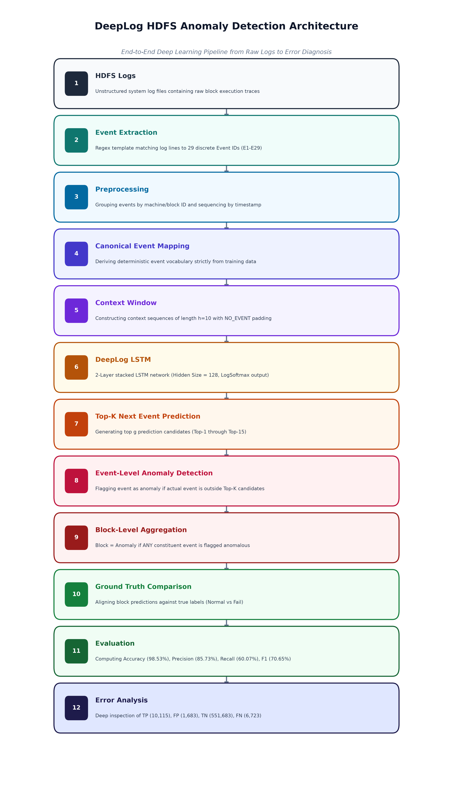
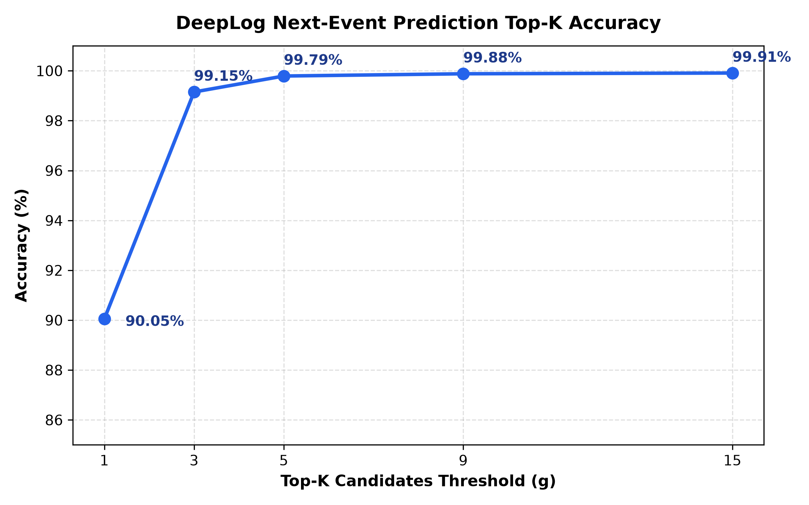
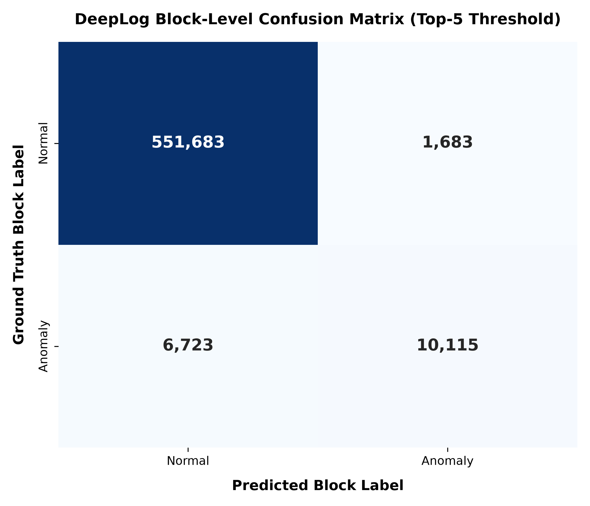
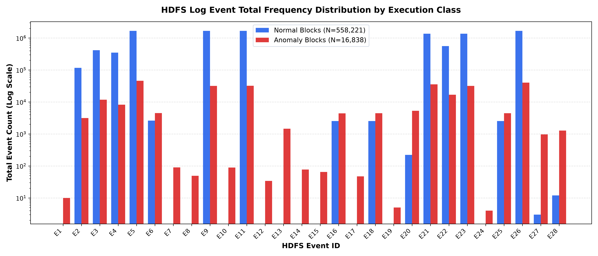
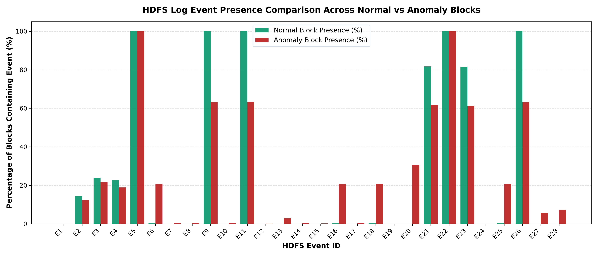
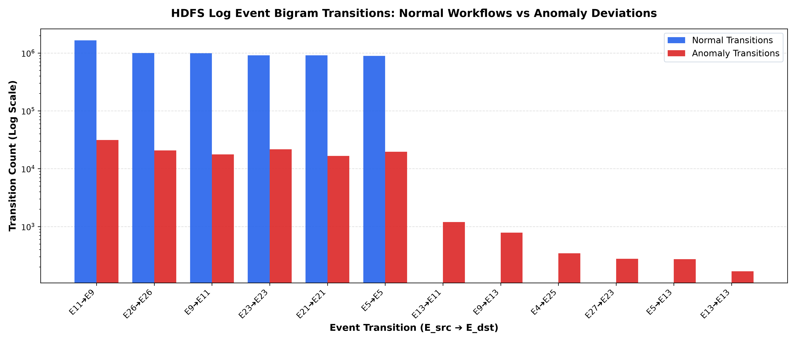

# DeepLog: HDFS Log Anomaly Detection with Deep Learning

[](https://www.python.org/)
[](https://pytorch.org/)
[](LICENSE)
[](tests/)

An implementation and empirical analysis of **DeepLog** (Du et al., ACM CCS 2017) applied to large-scale **Hadoop Distributed File System (HDFS)** log sequence anomaly detection.

This repository presents the completed baseline research experiment, an engineering investigation into categorical event-ID mapping consistency, comprehensive error and transition analysis, reproduction workflows, and an interactive diagnostic dashboard.

---

## Table of Contents
- [Overview](#overview)
- [Motivation](#motivation)
- [HDFS Dataset & Log Structure](#hdfs-dataset--log-structure)
- [Methodology & Pipeline](#methodology--pipeline)
- [Model Architecture](#model-architecture)
- [Important Engineering Discovery: The Event-ID Mapping Problem](#important-engineering-discovery-the-event-id-mapping-problem)
- [Official Experimental Results](#official-experimental-results)
- [Error Analysis & Case Studies](#error-analysis--case-studies)
- [Event Behavior & Transition Analysis](#event-behavior--transition-analysis)
- [Limitations & Engineering Trade-offs](#limitations--engineering-trade-offs)
- [Project Structure](#project-structure)
- [Reproducibility Guide](#reproducibility-guide)
- [Interactive Streamlit Dashboard](#interactive-streamlit-dashboard)
- [Project Status & Citation](#project-status--citation)

---

## Overview

Modern distributed computer systems generate enormous volumes of semi-structured text logs recording operational states, background tasks, and error messages. DeepLog treats system logs similarly to natural language: each log entry is parsed into a discrete **Event ID**, transforming unstructured execution streams into sequential event sentences. 

Using a stacked Long Short-Term Memory (LSTM) neural network, DeepLog learns the normal execution patterns of system tasks. During runtime, it predicts the probability distribution of the next expected log event given a rolling context window of preceding events. When an incoming event falls outside the model's top candidates ($g$ most likely predictions), an anomaly is flagged.

---

## Motivation

Automated log analysis is critical for modern cloud infrastructure and large-scale distributed systems:
1. **Human Scale Limits**: Production clusters generate gigabytes of log messages per minute. Manual inspection or static regex alerts fail to capture complex sequential failure modes.
2. **Context-Aware Detection**: Many critical failures are not caused by rare error keywords, but by **valid operations occurring in invalid sequential order** (e.g., trying to write to a block after its connection was terminated).
3. **Minimizing Operator Alert Fatigue**: In large deployments, a model with a high False Positive Rate (FPR) overwhelms operations engineers. DeepLog balances precision and low false-positive rates to ensure actionable alerting.

---

## HDFS Dataset & Log Structure

The benchmark dataset consists of log messages collected from a 203-node Hadoop cluster running MapReduce workloads (Carnegie Mellon University).

### Dataset Composition
- **Total Evaluated Blocks**: 575,061 blocks
- **Normal Execution Blocks**: 558,223 blocks (~97.07%)
  - Training set: 4,855 blocks
  - Evaluation set: 553,366 blocks
- **Anomalous Blocks**: 16,838 blocks (~2.93%)
- **Class Imbalance**: ~33:1 normal-to-anomaly ratio

### What an Event ID Is
A raw HDFS log entry such as:
```text
081109 203615 148 INFO dfs.DataNode$PacketResponder: PacketResponder 1 for block blk_-1608999687919862906 terminating
```
is abstracted via regex / Drain log parsers into a structured template:
`PacketResponder [*] for block [*] terminating`, represented compactly by **Event ID `E11`**.

The dataset defines **29 discrete event templates** (`E1` through `E29`), fully cataloged in [`dataset/HDFS_v1/HDFS.log_templates.csv`](dataset/HDFS_v1/HDFS.log_templates.csv).

### Execution Traces as Sequences
Each HDFS block execution consists of an ordered sequence of events from creation to closure/deletion:
```text
E5 ➔ E5 ➔ E5 ➔ E22 ➔ E11 ➔ E9 ➔ E11 ➔ E9 ➔ E26 ➔ E26 ➔ E23 ➔ E21
```
*Explanation*: 
- `E5` (Receiving block) 
- `E22` (allocateBlock) 
- `E11` (PacketResponder terminating) 
- `E9` (Received block) 
- `E26` (addStoredBlock) 
- `E23` (NameSystem delete) 
- `E21` (Deleting block file)

---

## Methodology & Pipeline

DeepLog processes and evaluates log sequences through an end-to-end multi-stage pipeline:

```
HDFS Logs
    ↓
Event Extraction (29 Templates)
    ↓
Preprocessing (Machine/Block Grouping)
    ↓
Canonical Event Mapping (Derived strictly from Training Data)
    ↓
Context Window Slicing (h = 10 events + NO_EVENT padding)
    ↓
DeepLog 2-Layer LSTM
    ↓
Top-K Next Event Prediction Candidates (g = 1..15)
    ↓
Event-Level Anomaly Detection (Actual event ∉ Top-K)
    ↓
Block-Level Aggregation (Block = Anomaly if ANY event is anomalous)
    ↓
Ground Truth Comparison (Test Normal vs Test Anomaly)
    ↓
Evaluation & Metric Computation
    ↓
Error Analysis (TP / FP / TN / FN Inspection)
```



---

## Model Architecture

The core sequence predictor is a recurrent neural network implemented in PyTorch:

| Parameter | Configuration |
|---|---|
| **Model Type** | Stacked Long Short-Term Memory (LSTM) |
| **LSTM Layers** | 2 |
| **Hidden Size** | 128 units |
| **Input Representation** | One-Hot Encoded Vector ($\text{dim} = 30$) |
| **Context Window ($h$)** | 10 events |
| **Output Layer** | Linear ($\text{dim} = 30$) + LogSoftmax |
| **Optimizer** | Adam ($\text{lr} = 0.001$) |
| **Loss Function** | Negative Log Likelihood Loss (NLLLoss) |
| **Training Epochs** | 40 |
| **Batch Size** | 256 |
| **Hardware Acceleration** | Apple Silicon MPS, CUDA, or CPU |

---

## Important Engineering Discovery: The Event-ID Mapping Problem

During early experimentation, a critical preprocessing issue was discovered that severely degraded model performance.

### The Problem
The upstream preprocessing implementation generated event index mappings dynamically per file:
```python
# BUGGY IMPLEMENTATION:
X_train, y_train, _, mapping_train = preprocessor.text("hdfs_train")
X_test_norm, y_test_norm, _, mapping_norm = preprocessor.text("hdfs_test_normal")
X_test_anom, y_test_anom, _, mapping_anom = preprocessor.text("hdfs_test_abnormal")
```
Because the training, normal test, and abnormal test files each contain different subsets of unique events, the integer index $k$ in `hdfs_test_normal` did **not** correspond to the same Event ID in `hdfs_train` or the model's output neurons. The model was evaluating predictions against shifted targets.

### The Solution
The vocabulary mapping must be derived **strictly from the training dataset** (preventing data leakage) and explicitly supplied to all evaluation splits:
```python
# CORRECT IMPLEMENTATION:
# 1. Extract canonical vocabulary from training data
_, _, _, train_mapping = preprocessor.text("examples/data/hdfs_train", verbose=False)

# 2. Reuse the identical mapping for test splits
X_test_norm, y_test_norm, _, _ = preprocessor.text("examples/data/hdfs_test_normal", mapping=train_mapping)
X_test_anom, y_test_anom, _, _ = preprocessor.text("examples/data/hdfs_test_abnormal", mapping=train_mapping)
```

### Impact
After fixing the event mapping consistency:
- **Top-1 next-event accuracy improved to 90.05%** on the full 11,077,032 test sequence points.
- **Top-5 next-event accuracy reached 99.79%**.

This highlights an essential lesson in machine learning software engineering: **categorical feature encodings and token vocabularies must remain strictly deterministic across train, validation, and inference boundaries.**

---

## Official Experimental Results

The evaluations below represent the verified baseline performance achieved by checkpoint `deeplog_model_improved_v1.pt`.

### 1. Next-Event Prediction Top-K Accuracy
Evaluated over all **11,077,032 test sequence data points**:

| Prediction Threshold | Candidate Set Size ($g$) | Next-Event Accuracy |
|:---|:---:|---:|
| **Top-1** | $g = 1$ | **90.05%** |
| **Top-3** | $g = 3$ | **99.15%** |
| **Top-5** | $g = 5$ | **99.79%** |
| **Top-9** | $g = 9$ | **99.88%** |
| **Top-15** | $g = 15$ | **99.91%** |



---

### 2. Block-Level Anomaly Detection Matrix
Evaluated on **570,204 evaluation blocks** (553,366 normal blocks + 16,838 anomaly blocks) across multiple candidate set thresholds $g$:

| Top-K ($g$) | Accuracy | Precision | Recall | F1-Score | False Positive Rate | True Positive (TP) | False Positive (FP) | True Negative (TN) | False Negative (FN) |
|:---:|:---:|:---:|:---:|:---:|:---:|:---:|:---:|:---:|:---:|
| **$g = 1$** | 24.87% | 3.78% | **100.00%** | 0.0729 | 77.4196% | 16,838 | 428,414 | 124,952 | 0 |
| **$g = 2$** | 77.15% | 7.91% | 63.32% | 0.1407 | 22.4253% | 10,661 | 124,094 | 429,272 | 6,177 |
| **$g = 3$** | 89.68% | 16.83% | 63.30% | 0.2659 | 9.5203% | 10,659 | 52,682 | 500,684 | 6,179 |
| **$g = 4$** | 98.32% | 76.33% | 62.47% | 0.6871 | 0.5895% | 10,519 | 3,262 | 550,104 | 6,319 |
| **$g = 5$ ⭐** | **98.53%** | **85.73%** | **60.07%** | **70.65%** | **0.3041%** | **10,115** | **1,683** | **551,683** | **6,723** |
| **$g = 9$** | 98.48% | 94.68% | 51.32% | 0.6656 | 0.0878% | 8,641 | 486 | 552,880 | 8,197 |
| **$g = 15$** | 98.39% | 97.10% | 46.97% | 0.6331 | 0.0426% | 7,908 | 236 | 553,130 | 8,930 |

### Official Baseline Confusion Matrix ($g = 5$)



$$\begin{aligned}
\text{Accuracy} &= \frac{10,115 + 551,683}{570,204} = \mathbf{98.53\%} \\
\text{Precision} &= \frac{10,115}{10,115 + 1,683} = \mathbf{85.73\%} \\
\text{Recall} &= \frac{10,115}{10,115 + 6,723} = \mathbf{60.07\%} \\
\text{F1-Score} &= \frac{2 \times (0.8573 \times 0.6007)}{0.8573 + 0.6007} = \mathbf{70.65\%} \\
\text{False Positive Rate (FPR)} &= \frac{1,683}{1,683 + 551,683} = \mathbf{0.3041\%}
\end{aligned}$$

---

## Error Analysis & Case Studies

Concrete examples extracted by [`analysis/confusion_analysis.py`](analysis/confusion_analysis.py) illustrate the model's operational behavior:

### 1. True Positive (TP = 10,115)
- **Block Index**: Anomaly set, block `0` (length 25)
- **First Anomaly Step**: Event 22 in sequence
- **Context Used ($h=10$)**: `E26 ➔ E6 ➔ E6 ➔ E5 ➔ E4 ➔ E23 ➔ E23 ➔ E23 ➔ E21 ➔ E21`
- **Actual Event**: `E28` (*addStoredBlock request received for block that does not belong to any file*)
- **Top-5 Predicted Candidates**: `[E21, E2, E3, E4, E25]`
- **Diagnosis**: Correctly flagged. After deletion markers (`E23`, `E21`), normal blocks finalize; receiving an orphan block notice (`E28`) is highly anomalous.

### 2. False Positive (FP = 1,683)
- **Block Index**: Normal set, block `63` (length 36)
- **First Flagged Step**: Event 13 in sequence
- **Context Used ($h=10$)**: `E9 ➔ E26 ➔ E26 ➔ E23 ➔ E21 ➔ E23 ➔ E21 ➔ E23 ➔ E21 ➔ E4`
- **Actual Event**: `E26` (*addStoredBlock: blockMap updated*)
- **Top-5 Predicted Candidates**: `[E4, E23, E3, E2, E25]`
- **Diagnosis**: In rare normal execution paths, an additional `E26` blockMap update is logged after an exception serving event `E4`. Because this sequence was uncommon in training, the model assigned low probability to `E26`.

### 3. True Negative (TN = 551,683)
- **Block Index**: Normal set, block `0` (length 19)
- **Sequence**: Standard replication flow (`E9 ➔ ... ➔ E22 ➔ E23 ➔ E21 ➔ E26 ➔ E23 ➔ E21`)
- **Diagnosis**: All 19 steps matched candidate sets. Block correctly accepted with zero false alarm.

### 4. False Negative (FN = 6,723)
- **Block Index**: Anomaly set, block `1` (length 3)
- **Sequence**: `E9 ➔ E22 ➔ E9`
- **Diagnosis**: Truncated or extremely short execution sequence. Because the context is heavily padded with `NO_EVENT` and the individual events (`E9`, `E22`) are common throughout normal execution, their transition likelihood falls within Top-5, causing the anomaly to evade detection.

---

## Event Behavior & Transition Analysis

Empirical analysis on 575,061 traces revealed critical characteristics of HDFS log behavior:

### Statistical Event Distribution



### Key Behavioral Insights
1. **Ubiquitous Operations (Non-discriminating alone)**:
   - Events `E5` (*Receiving block*) and `E22` (*allocateBlock*) appear in **100% of normal blocks** and **100% of anomalous blocks**. Their sheer presence or frequency cannot prove an anomaly.
2. **Anomaly-Associated Event Indicators**:
   - `E20` (*Unexpected error trying to delete block*), `E6`, `E16`, and `E18` appear predominantly in anomaly traces (present in up to 30.4% of anomaly blocks vs <0.3% of normal blocks).
   - *Scientific Note*: These events are **correlated with anomaly blocks** in this dataset; they must **not** be described as root causes of system failure.
3. **Sequential Bigram Deviations**:
   
   - The transition **`E5 ➔ E7`** (*Receiving block ➔ writeBlock received exception*) occurs **1,993 times in anomaly blocks** and **0 times in normal blocks**. It is a forbidden transition in standard execution workflows.

---

## Limitations & Engineering Trade-offs

1. **Extreme Class Imbalance**: With only 2.93% anomalous blocks, raw accuracy (98.53%) is dominated by True Negatives. F1-score (70.65%) and FPR (0.3041%) are the primary operational metrics.
2. **Recall vs. Precision Trade-off**: At $g=5$, recall is 60.07% while precision is 85.73%. Increasing sensitivity (lowering $g$ to 1 or 2) catches more anomalies but causes massive false alarm rates (FPR jumps from 0.30% to 22.4% - 77.4%).
3. **Short Sequence Blind Spots**: Sequences shorter than context length ($h=10$) are padded, making subtle deviations among routine events harder to catch.
4. **Vocabulary Generalization**: Unseen events outside the training vocabulary must be handled as anomalies by default.
5. **Next-Event Accuracy vs. Anomaly Performance**: High next-event prediction accuracy (99.79% Top-5) does not translate directly to 99% anomaly detection recall because a single missed transition in an anomalous block will cause an entire block misclassification.

---

## Project Structure

```
DeepLog/
├── README.md                          # Comprehensive documentation & research summary
├── LICENSE                            # MIT License
├── requirements.txt                   # Pinned project dependencies
├── .gitignore                         # Git exclusion rules (models, logs, large data)
├── setup.py                           # Editable package installer
├── app.py                             # Interactive Streamlit demo dashboard
│
├── src/
│   └── deeplog/
│       ├── __init__.py                # Package exports (DeepLog, Preprocessor)
│       ├── deeplog.py                 # Stacked LSTM PyTorch model definition
│       └── preprocessor.py            # Event extraction, canonical mapping & sequence builders
│
├── scripts/
│   ├── train.py                       # CLI training script with validation tracking
│   ├── evaluate.py                    # Vectorized benchmark (next-event & block-level)
│   ├── predict.py                     # CLI sequence anomaly diagnoser
│   └── generate_workflow_diagram.py   # Renders docs/workflow.png
│
├── analysis/
│   ├── event_frequency.py             # Event distribution & block presence analysis
│   ├── event_transition.py            # Bigram transition mining (e.g. E5->E7)
│   └── confusion_analysis.py          # Verified TP, FP, TN, FN block analysis & figures
│
├── results/
│   ├── metrics/
│   │   ├── next_event_metrics.json    # Exported next-event accuracy benchmarks
│   │   └── block_anomaly_metrics.json # Exported multi-threshold performance matrix
│   ├── figures/
│   │   ├── block_distribution.png     # HDFS class balance visualization
│   │   ├── confusion_matrix.png       # Publication-style confusion matrix
│   │   ├── event_frequency.png        # Normal vs Anomaly total event count
│   │   ├── event_presence.png         # Percentage presence across blocks
│   │   ├── event_transitions.png      # Top normal & anomaly-associated bigrams
│   │   └── topk_accuracy.png          # Top-K candidate accuracy curve
│   └── examples/
│       └── error_cases.json           # Concrete TP, FP, TN, FN block examples
│
├── docs/
│   └── workflow.png                   # End-to-end pipeline diagram
│
├── dataset/
│   ├── README.md                      # Dataset documentation & acquisition instructions
│   └── HDFS_v1/
│       └── HDFS.log_templates.csv     # 29 HDFS event templates
│
├── examples/
│   └── data/                          # Sequence splits used for reproducible evaluation
│       ├── hdfs_train                 # 4,855 training sequences
│       ├── hdfs_test_normal           # 553,366 normal test sequences
│       └── hdfs_test_abnormal         # 16,838 anomaly test sequences
│
└── tests/
    ├── test_mapping.py                # Deterministic vocabulary mapping tests
    ├── test_preprocessor.py           # Context slicing & padding tests
    ├── test_model.py                  # PyTorch model forward pass & shape tests
    └── test_metrics.py                # Metric formulas & block aggregation tests
```

---

## Reproducibility Guide

### 1. Environment Setup
```bash
# Clone the repository
git clone https://github.com/<your-username>/DeepLog.git
cd DeepLog

# Create and activate a virtual environment
python3 -m venv venv
source venv/bin/activate

# Install dependencies and local editable package
pip install -r requirements.txt
pip install -e .
```

### 2. Run Automated Unit Tests
```bash
pytest tests/ -v
```

### 3. Run Benchmark Evaluation
To reproduce the official evaluation metrics using the trained baseline checkpoint:
```bash
python scripts/evaluate.py --model_path deeplog_model_improved_v1.pt
```

### 4. Run Data & Confusion Analysis
```bash
# Generate frequency and presence figures
python analysis/event_frequency.py

# Generate bigram transition figures
python analysis/event_transition.py

# Run verified confusion analysis, generate matrix & case studies
python analysis/confusion_analysis.py
```

### 5. Run Single Sequence Inference CLI
```bash
# Normal sequence test
python scripts/predict.py --sequence "5 5 5 22 11 9 11 9 11 9 26 26 26 23 23 23 21 21 21"

# Anomaly sequence test (contains unexpected E7 write exception)
python scripts/predict.py --sequence "5 5 5 22 11 9 7 9 26 26"
```

### 6. (Optional) Retrain from Scratch
```bash
python scripts/train.py --epochs 40 --batch_size 256 --hidden_size 128 --output_model deeplog_retrained.pt
```

---

## Interactive Streamlit Dashboard

Launch the interactive local web dashboard:
```bash
streamlit run app.py
```
The dashboard allows inspecting dataset statistics, exploring visual performance benchmarks, and typing arbitrary event sequences to view step-by-step next-event probability evaluations.

---

## Project Status & Citation

> **Project Status**: Completed baseline experimental research and software engineering polish. Prepared for portfolio presentation and reproducible benchmarking. Not intended for direct turn-key production deployment without distributed streaming integrations (e.g., Kafka / Flink).

If using this codebase for academic research, please cite the foundational papers:

```bibtex
@inproceedings{du2017deeplog,
  title={{DeepLog: Anomaly Detection and Diagnosis from System Logs through Deep Learning}},
  author={Du, Min and Li, Feifei and Zheng, Guineng and Srikumar, Vivek},
  booktitle={Proceedings of the 2017 ACM SIGSAC Conference on Computer and Communications Security (CCS)},
  pages={1285--1298},
  year={2017}
}

@inproceedings{vanede2022deepcase,
  title={{DeepCASE: Semi-Supervised Contextual Analysis of Security Events}},
  author={van Ede, Thijs and Aghakhani, Hojjat and Spahn, Noah and Bortolameotti, Riccardo and Cova, Marco and Continella, Andrea and van Steen, Maarten and Peter, Andreas and Kruegel, Christopher and Vigna, Giovanni},
  booktitle={Proceedings of the 2022 IEEE Symposium on Security and Privacy (S&P)},
  year={2022}
}
```
